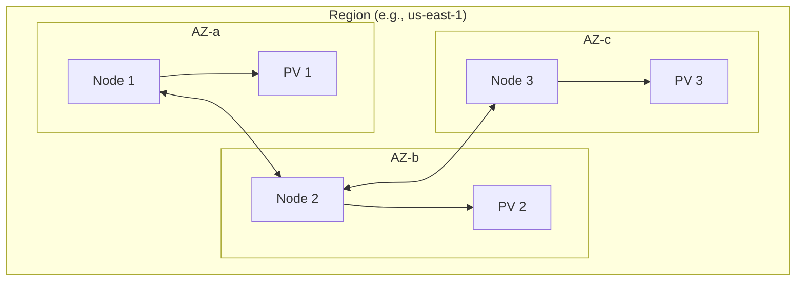
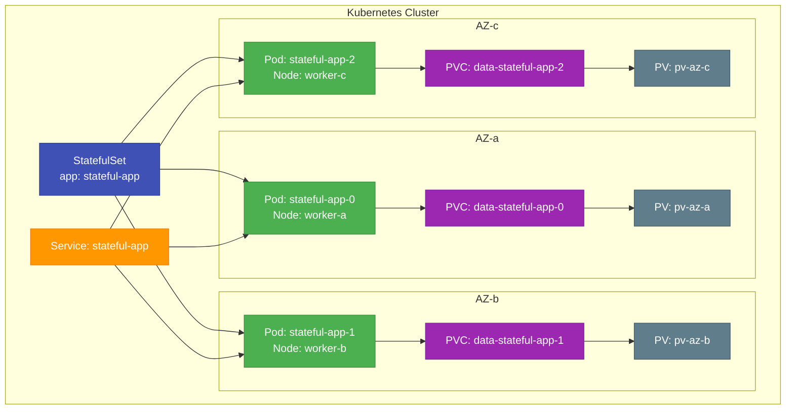
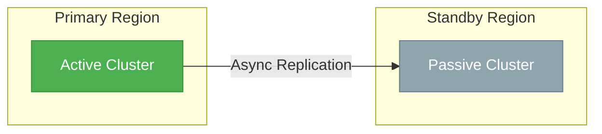
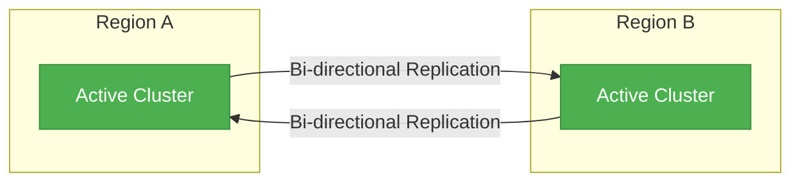
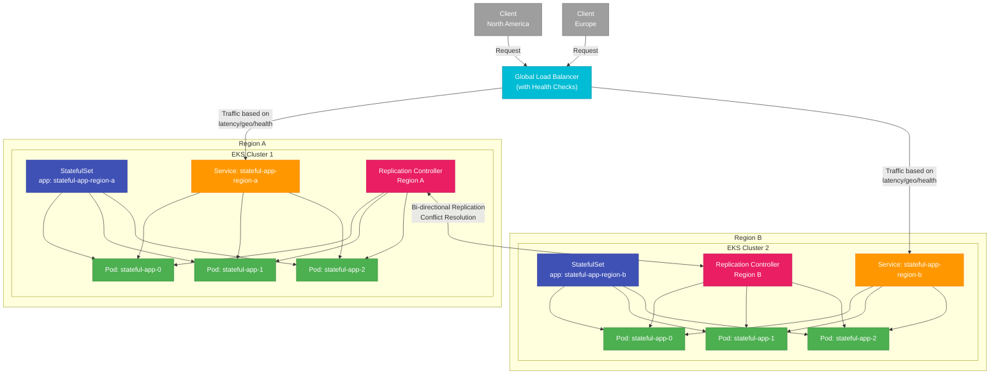

```mermaid
graph TD
    subgraph "Primary Region"
        subgraph "EKS Cluster 1"
            SS1["StatefulSet<br>app: stateful-app"]
            Pod1["Pod: stateful-app-0"]
            Pod2["Pod: stateful-app-1"]
            Pod3["Pod: stateful-app-2"]

            SS1 --> Pod1
            SS1 --> Pod2
            SS1 --> Pod3

            SVC1["Service: stateful-app"]
            SVC1 --> Pod1
            SVC1 --> Pod2
            SVC1 --> Pod3

            Rep["Replication Controller<br>(MirrorMaker/CCR/etc)"]
            Rep --> Pod1
            Rep --> Pod2
            Rep --> Pod3
        end
    end

    subgraph "Standby Region"
        subgraph "EKS Cluster 2"
            SS2["StatefulSet<br>app: stateful-app-standby"]
            SPod1["Pod: stateful-app-standby-0"]
            SPod2["Pod: stateful-app-standby-1"]
            SPod3["Pod: stateful-app-standby-2"]

            SS2 --> SPod1
            SS2 --> SPod2
            SS2 --> SPod3

            SVC2["Service: stateful-app-standby"]
            SVC2 --> SPod1
            SVC2 --> SPod2
            SVC2 --> SPod3
        end
    end

    Rep -->|"Async Replication<br>Over Direct Connect/VPN"| SPod1
    Rep -->|"Async Replication<br>Over Direct Connect/VPN"| SPod2
    Rep -->|"Async Replication<br>Over Direct Connect/VPN"| SPod3

    DNS["Global DNS<br>(Route53/Azure DNS/Cloud DNS)"]
    DNS -->|"Active"| SVC1
    DNS -.->|"Failover (inactive)"| SVC2

    style SS1 fill:#3F51B5,stroke:#303F9F,color:white
    style SS2 fill:#3F51B5,stroke:#303F9F,color:white,stroke-dasharray: 5 5
    style SVC1 fill:#FF9800,stroke:#F57C00,color:white
    style SVC2 fill:#FF9800,stroke:#F57C00,color:white,stroke-dasharray: 5 5
    style Rep fill:#E91E63,stroke:#C2185B,color:white
    style DNS fill:#00BCD4,stroke:#0097A7,color:white
    style Pod1 fill:#4CAF50,stroke:#388E3C,color:white
    style Pod2 fill:#4CAF50,stroke:#388E3C,color:white
    style Pod3 fill:#4CAF50,stroke:#388E3C,color:white
    style SPod1 fill:#78909C,stroke:#546E7A,color:white,stroke-dasharray: 5 5
    style SPod2 fill:#78909C,stroke:#546E7A,color:white,stroke-dasharray: 5 5
    style SPod3 fill:#78909C,stroke:#546E7A,color:white,stroke-dasharray: 5 5
```

# Kubernetes Stateful Workloads: Multi-Region and High Availability Guide

> **DISCLAIMER**: This document does not provide official recommendations and is for informational purposes only. The content is based on documentation and information available at the time of writing and may contain errors, omissions, or outdated information. Technology landscapes evolve rapidly, and readers should conduct their own research and testing before making production decisions. The authors do not assume any liability for actions taken based on this document.
>
> **IMPORTANT NOTICE ON DATA SOURCES**: All performance metrics, benchmarks, cost estimates, and implementation examples in this document are hypothetical and for illustrative purposes only. They are not based on actual testing, real-world deployments, or empirical data collection. The figures presented are approximations derived from general industry knowledge, public documentation, and theoretical understanding of the technologies discussed. These examples were created to demonstrate conceptual principles and typical patterns rather than to provide definitive performance or cost data. Actual performance, costs, and implementation details will vary significantly based on specific hardware, software versions, configurations, workload characteristics, and operational practices.
>
> **CASE STUDY DISCLAIMER**: The case studies presented in this document are entirely fictional and do not represent real organizations or actual implementation projects. They were created to illustrate common patterns and considerations in multi-region, high-availability deployments of stateful workloads in Kubernetes.

**Version:** 1.0 (May 2025)

## Table of Contents

1. [Executive Summary](#executive-summary)
2. [Introduction to Stateful Workloads in Kubernetes](#introduction-to-stateful-workloads-in-kubernetes)
3. [Core Concepts and Challenges](#core-concepts-and-challenges)
4. [Cloud Provider Availability Zone and Region Architecture](#cloud-provider-availability-zone-and-region-architecture)
   - [AWS](#aws-architecture)
   - [Azure](#azure-architecture)
   - [GCP](#gcp-architecture)
5. [Stateful Workload Operators](#stateful-workload-operators)
   - [Kafka (Strimzi)](#kafka-strimzi-operator)
   - [Elasticsearch](#elasticsearch-operator)
   - [PostgreSQL](#postgresql-operators)
   - [MongoDB](#mongodb-operators)
   - [Redis](#redis-operators)
6. [Implementation Patterns](#implementation-patterns)
   - [Single-Region, Multi-AZ](#single-region-multi-az)
   - [Multi-Region Active-Passive](#multi-region-active-passive)
   - [Multi-Region Active-Active](#multi-region-active-active)
7. [Cloud-Specific Implementation Guides](#cloud-specific-implementation-guides)
   - [AWS EKS](#aws-eks-implementation)
   - [Azure AKS](#azure-aks-implementation)
   - [GCP GKE](#gcp-gke-implementation)
8. [Real-World Case Studies](#real-world-case-studies)
9. [Performance and Cost Considerations](#performance-and-cost-considerations)
10. [Implementation Recommendations](#implementation-recommendations)
11. [Conclusion](#conclusion)
12. [References](#references)

## Executive Summary

Running stateful workloads in Kubernetes across multiple availability zones and regions requires careful planning and implementation. This guide provides a comprehensive analysis of architectural patterns, cloud provider capabilities, and operator-based solutions for deploying highly available stateful applications like Kafka, Elasticsearch, and databases in Kubernetes environments. The document outlines specific requirements and configurations for AWS EKS, Azure AKS, and Google GKE, along with real-world implementation examples and best practices.

## Introduction to Stateful Workloads in Kubernetes

Stateful workloads in Kubernetes present unique challenges compared to stateless applications. While Kubernetes was initially designed with stateless applications in mind, it has evolved to provide robust support for stateful workloads through features like StatefulSets, Persistent Volumes, and Storage Classes. However, achieving high availability across availability zones and regions requires additional considerations and configurations.

### Key Characteristics of Stateful Workloads

* **Persistent Storage**: Require durable storage that survives pod restarts
* **Stable Network Identities**: Need consistent hostnames and network identifiers
* **Ordered Deployment and Scaling**: Often require specific startup and shutdown sequences
* **Data Consistency**: Must maintain data integrity across replicas
* **Backup and Recovery**: Require robust backup and restore mechanisms

### Evolution of Kubernetes Support for Stateful Workloads

* **StatefulSets**: Introduced in Kubernetes 1.5 (beta), GA in 1.9
* **Persistent Volume Claims**: Allow pods to request specific storage resources
* **Storage Classes**: Enable dynamic provisioning of storage with specific characteristics
* **Volume Snapshots**: Support for point-in-time copies of volumes
* **CSI Drivers**: Standardized interface for storage providers
* **Operators**: Custom controllers that extend Kubernetes API for specific applications

## Core Concepts and Challenges

### Fundamental Challenges

1. **Data Replication**: Ensuring data is replicated across failure domains
2. **Consistency vs. Availability**: Balancing CAP theorem trade-offs
3. **Network Latency**: Managing increased latency in multi-region deployments
4. **Data Sovereignty**: Addressing regulatory requirements for data location
5. **Disaster Recovery**: Implementing robust backup and recovery procedures

### Critical Kubernetes Concepts for Stateful Workloads

#### StatefulSets

> **MANIFEST DISCLAIMER**: The following YAML manifest is provided as a basic example for illustrative purposes only. It is not a production-ready configuration and has not been fully tested in all environments. You will need to modify this example to suit your specific requirements, including resource limits, security contexts, liveness/readiness probes, and other best practices. Always test thoroughly before deploying to production.

```yaml
apiVersion: apps/v1
kind: StatefulSet
metadata:
  name: example-statefulset
spec:
  serviceName: "example"
  replicas: 3
  selector:
    matchLabels:
      app: example
  template:
    metadata:
      labels:
        app: example
    spec:
      containers:
      - name: example-container
        image: example-image
        volumeMounts:
        - name: data
          mountPath: /data
  volumeClaimTemplates:
  - metadata:
      name: data
    spec:
      accessModes: [ "ReadWriteOnce" ]
      storageClassName: "standard"
      resources:
        requests:
          storage: 10Gi
```

#### Persistent Volumes and Claims

* **PersistentVolume (PV)**: Cluster-wide storage resource
* **PersistentVolumeClaim (PVC)**: Request for storage by a pod
* **StorageClass**: Defines the type of storage to provision

#### Pod Disruption Budgets

Essential for ensuring high availability during voluntary disruptions:

> **MANIFEST DISCLAIMER**: The following YAML manifest is provided as a basic example for illustrative purposes only. It is not a production-ready configuration and has not been fully tested in all environments. You will need to modify this example to suit your specific requirements. Always test thoroughly before deploying to production.

```yaml
apiVersion: policy/v1
kind: PodDisruptionBudget
metadata:
  name: example-pdb
spec:
  minAvailable: 2  # or maxUnavailable: 1
  selector:
    matchLabels:
      app: example
```

#### Anti-Affinity Rules

Critical for distributing pods across failure domains:

```yaml
affinity:
  podAntiAffinity:
    requiredDuringSchedulingIgnoredDuringExecution:
    - labelSelector:
        matchExpressions:
        - key: app
          operator: In
          values:
          - example
      topologyKey: "topology.kubernetes.io/zone"
```

### Storage Considerations

* **Storage Performance**: IOPS, throughput, and latency requirements
* **Storage Availability**: Replication and redundancy mechanisms
* **Data Protection**: Backup, snapshots, and disaster recovery
* **Storage Classes**: Provider-specific options for different workloads

## Cloud Provider Availability Zone and Region Architecture

Understanding the architecture of availability zones and regions across major cloud providers is essential for designing highly available stateful workloads in Kubernetes.

### AWS Architecture

AWS organizes its infrastructure into Regions and Availability Zones (AZs):

* **Regions**: Separate geographic areas (e.g., us-east-1, eu-west-1)
* **Availability Zones**: Isolated locations within a region (e.g., us-east-1a, us-east-1b)
* **Local Zones**: Extensions of regions closer to population centers
* **Wavelength Zones**: Infrastructure deployments at the edge of 5G networks

#### AWS EKS Availability Zone Considerations

* **Worker Nodes**: Can span multiple AZs within a region
* **Control Plane**: Managed by AWS across multiple AZs
* **EBS Volumes**: Restricted to a single AZ
* **EFS**: Available across all AZs in a region
* **Cross-Region Replication**: Requires application-level solutions

#### AWS Storage Options for Stateful Workloads

| Storage Type | Multi-AZ Support | Cross-Region | Use Case |
|--------------|------------------|--------------|----------|
| EBS | No (AZ-bound) | No | Single-AZ workloads |
| EFS | Yes | No | Shared file systems across AZs |
| S3 | Yes | Optional | Object storage, backups |
| Aurora | Yes | Optional | Managed database service |
| FSx for Lustre | No (AZ-bound) | No | High-performance computing |

### Azure Architecture

Azure's infrastructure is organized into:

* **Regions**: Geographic areas containing one or more datacenters
* **Availability Zones**: Physically separate datacenters within a region
* **Availability Sets**: Logical grouping within a datacenter for rack-level redundancy
* **Region Pairs**: Regions with direct connections for disaster recovery

#### Azure AKS Availability Zone Considerations

* **Worker Nodes**: Can be deployed across multiple AZs
* **Control Plane**: Managed by Azure, can be zone-redundant
* **Managed Disks**: Restricted to a single AZ
* **Azure Files**: Available across all AZs in a region
* **Zone-Redundant Storage**: Available for select storage types

#### Azure Storage Options for Stateful Workloads

| Storage Type | Multi-AZ Support | Cross-Region | Use Case |
|--------------|------------------|--------------|----------|
| Azure Disk | No (AZ-bound) | No | Single-AZ workloads |
| Azure Files | Yes | No | Shared file systems across AZs |
| Azure Blob | Yes | Optional | Object storage, backups |
| Azure NetApp Files | Yes | No | High-performance file storage |
| Azure SQL | Yes | Optional | Managed database service |

### GCP Architecture

Google Cloud Platform organizes its infrastructure into:

* **Regions**: Geographic areas containing multiple zones
* **Zones**: Isolated locations within a region
* **Multi-Region**: Group of two or more geographic regions

#### GCP GKE Availability Zone Considerations

* **Worker Nodes**: Can span multiple zones within a region
* **Control Plane**: Can be zonal or regional (multi-zone)
* **Persistent Disks**: Regional PDs available for multi-zone redundancy
* **Filestore**: Available within a single zone or region-wide
* **Cross-Region Replication**: Requires application-level solutions

#### GCP Storage Options for Stateful Workloads

| Storage Type | Multi-Zone Support | Cross-Region | Use Case |
|--------------|-------------------|--------------|----------|
| Zonal Persistent Disk | No (Zone-bound) | No | Single-zone workloads |
| Regional Persistent Disk | Yes (2 zones) | No | Multi-zone redundancy |
| Filestore | Basic/Enterprise: No<br>Enterprise Plus: Yes | No | Shared file systems |
| Cloud Storage | Yes | Yes | Object storage, backups |
| Cloud SQL | Yes | Optional | Managed database service |

## Stateful Workload Operators

Kubernetes Operators extend the Kubernetes API to create, configure, and manage instances of complex stateful applications. They encapsulate operational knowledge and automate day-2 operations, making them ideal for managing stateful workloads across multiple availability zones and regions.

### Kafka (Strimzi Operator)

[Strimzi](https://strimzi.io/) provides a way to run an Apache Kafka cluster on Kubernetes in various deployment configurations.

#### Multi-AZ Deployment Requirements

* **Pod Distribution**: Kafka brokers must be distributed across AZs
* **Storage**: Each broker requires persistent storage in its AZ
* **Network**: Low-latency connectivity between brokers
* **Zookeeper**: Must also be distributed across AZs (or use KRaft mode)

#### Example Strimzi Multi-AZ Configuration

```yaml
apiVersion: kafka.strimzi.io/v1beta2
kind: Kafka
metadata:
  name: my-cluster
spec:
  kafka:
    version: 3.5.0
    replicas: 3
    listeners:
      - name: plain
        port: 9092
        type: internal
        tls: false
      - name: tls
        port: 9093
        type: internal
        tls: true
    config:
      offsets.topic.replication.factor: 3
      transaction.state.log.replication.factor: 3
      transaction.state.log.min.isr: 2
      default.replication.factor: 3
      min.insync.replicas: 2
    storage:
      type: jbod
      volumes:
      - id: 0
        type: persistent-claim
        size: 100Gi
        deleteClaim: false
    template:
      pod:
        affinity:
          podAntiAffinity:
            requiredDuringSchedulingIgnoredDuringExecution:
              - labelSelector:
                  matchExpressions:
                    - key: strimzi.io/name
                      operator: In
                      values:
                        - my-cluster-kafka
                topologyKey: topology.kubernetes.io/zone
  zookeeper:
    replicas: 3
    storage:
      type: persistent-claim
      size: 100Gi
      deleteClaim: false
    template:
      pod:
        affinity:
          podAntiAffinity:
            requiredDuringSchedulingIgnoredDuringExecution:
              - labelSelector:
                  matchExpressions:
                    - key: strimzi.io/name
                      operator: In
                      values:
                        - my-cluster-zookeeper
                topologyKey: topology.kubernetes.io/zone
```

#### Multi-Region Kafka Considerations

* **MirrorMaker2**: Used for cross-region replication
* **Latency Impact**: Higher latency affects replication and can impact performance
* **Active-Active**: Challenging due to potential conflicts; often implemented as active-passive
* **Topic Naming**: Careful planning required for topic naming across regions

### Elasticsearch Operator

The [Elastic Cloud on Kubernetes (ECK)](https://www.elastic.co/guide/en/cloud-on-k8s/current/k8s-overview.html) operator automates the deployment, provisioning, management, and orchestration of Elasticsearch clusters on Kubernetes.

#### Multi-AZ Deployment Requirements

* **Node Distribution**: Elasticsearch nodes should be distributed across AZs
* **Master Nodes**: Require odd number (typically 3) across different AZs
* **Data Nodes**: Should be distributed with shard allocation awareness
* **Storage**: Each node requires persistent storage in its AZ

#### Example ECK Multi-AZ Configuration

```yaml
apiVersion: elasticsearch.k8s.elastic.co/v1
kind: Elasticsearch
metadata:
  name: elasticsearch-cluster
spec:
  version: 8.9.0
  nodeSets:
  - name: master
    count: 3
    config:
      node.roles: ["master"]
      cluster.routing.allocation.awareness.attributes: zone
      node.attr.zone: "${ZONE_LABEL}"
    podTemplate:
      spec:
        affinity:
          podAntiAffinity:
            requiredDuringSchedulingIgnoredDuringExecution:
            - labelSelector:
                matchLabels:
                  elasticsearch.k8s.elastic.co/cluster-name: elasticsearch-cluster
                  elasticsearch.k8s.elastic.co/node-set: master
              topologyKey: topology.kubernetes.io/zone
        containers:
        - name: elasticsearch
          env:
          - name: ZONE_LABEL
            valueFrom:
              fieldRef:
                fieldPath: metadata.labels['topology.kubernetes.io/zone']
    volumeClaimTemplates:
    - metadata:
        name: elasticsearch-data
      spec:
        accessModes:
        - ReadWriteOnce
        resources:
          requests:
            storage: 100Gi
  - name: data
    count: 6
    config:
      node.roles: ["data"]
      cluster.routing.allocation.awareness.attributes: zone
      node.attr.zone: "${ZONE_LABEL}"
    podTemplate:
      spec:
        affinity:
          podAntiAffinity:
            requiredDuringSchedulingIgnoredDuringExecution:
            - labelSelector:
                matchLabels:
                  elasticsearch.k8s.elastic.co/cluster-name: elasticsearch-cluster
                  elasticsearch.k8s.elastic.co/node-set: data
              topologyKey: topology.kubernetes.io/zone
        containers:
        - name: elasticsearch
          env:
          - name: ZONE_LABEL
            valueFrom:
              fieldRef:
                fieldPath: metadata.labels['topology.kubernetes.io/zone']
    volumeClaimTemplates:
    - metadata:
        name: elasticsearch-data
      spec:
        accessModes:
        - ReadWriteOnce
        resources:
          requests:
            storage: 1Ti
```

#### Multi-Region Elasticsearch Considerations

* **Cross-Cluster Replication (CCR)**: Enables replication between clusters in different regions
* **Cross-Cluster Search**: Allows querying data across multiple clusters
* **Snapshot/Restore**: For disaster recovery and data migration
* **Index Lifecycle Management**: For managing data retention and migration

### PostgreSQL Operators

Several operators are available for PostgreSQL on Kubernetes, with the most popular being:

1. **[Zalando Postgres Operator](https://github.com/zalando/postgres-operator)**
2. **[Crunchy Data PGO](https://github.com/CrunchyData/postgres-operator)**
3. **[CloudNativePG](https://cloudnative-pg.io/)**

#### Multi-AZ Deployment Requirements

* **Primary-Replica Architecture**: One primary and multiple replicas
* **Pod Distribution**: Pods should be distributed across AZs
* **Synchronous Replication**: For data consistency (with performance trade-offs)
* **Storage**: Each instance requires persistent storage in its AZ
* **Failover Mechanism**: Automatic promotion of replica to primary

#### Example CloudNativePG Multi-AZ Configuration

```yaml
apiVersion: postgresql.cnpg.io/v1
kind: Cluster
metadata:
  name: postgres-cluster
spec:
  instances: 3
  primaryUpdateStrategy: unsupervised

  # PostgreSQL configuration
  postgresql:
    parameters:
      shared_buffers: 256MB
      max_connections: 100

  # Streaming replication configuration
  bootstrap:
    recovery:
      source: postgres-cluster

  # High availability configuration
  replicationSlots:
    highAvailability:
      enabled: true

  # Storage configuration
  storage:
    size: 10Gi
    storageClass: standard

  # Affinity rules for multi-AZ deployment
  affinity:
    podAntiAffinity:
      requiredDuringSchedulingIgnoredDuringExecution:
      - labelSelector:
          matchLabels:
            postgresql.cnpg.io/cluster: postgres-cluster
        topologyKey: topology.kubernetes.io/zone

  # Backup configuration
  backup:
    barmanObjectStore:
      destinationPath: s3://backup/
      s3Credentials:
        accessKeyId:
          name: s3-creds
          key: ACCESS_KEY_ID
        secretAccessKey:
          name: s3-creds
          key: ACCESS_SECRET_KEY
      wal:
        compression: gzip
        maxParallel: 8
```

#### Multi-Region PostgreSQL Considerations

* **Logical Replication**: For cross-region data synchronization
* **BDR (Bi-Directional Replication)**: For active-active setups (requires enterprise PostgreSQL)
* **Latency Impact**: Write operations affected by network latency
* **Conflict Resolution**: Required for active-active setups

### MongoDB Operators

The primary operator for MongoDB on Kubernetes is the [MongoDB Enterprise Kubernetes Operator](https://github.com/mongodb/mongodb-enterprise-kubernetes) from MongoDB Inc., though community alternatives exist.

#### Multi-AZ Deployment Requirements

* **Replica Set Architecture**: Primary with multiple secondaries
* **Pod Distribution**: Members should be distributed across AZs
* **Storage**: Each instance requires persistent storage in its AZ
* **Voting Members**: Odd number of voting members (typically 3)
* **Arbiter**: Optional non-data-bearing voting member

#### Example MongoDB Enterprise Operator Multi-AZ Configuration

```yaml
apiVersion: mongodb.com/v1
kind: MongoDBCommunity
metadata:
  name: mongodb-replica-set
spec:
  members: 3
  type: ReplicaSet
  version: "6.0.5"

  # Security settings
  security:
    authentication:
      modes: ["SCRAM"]

  # MongoDB configuration
  additionalMongodConfig:
    storage.wiredTiger.engineConfig.journalCompressor: zlib

  # Storage configuration
  statefulSet:
    spec:
      volumeClaimTemplates:
        - metadata:
            name: data-volume
          spec:
            accessModes: ["ReadWriteOnce"]
            resources:
              requests:
                storage: 10Gi

  # Affinity rules for multi-AZ deployment
  podSpec:
    affinity:
      podAntiAffinity:
        requiredDuringSchedulingIgnoredDuringExecution:
          - labelSelector:
              matchExpressions:
                - key: app
                  operator: In
                  values:
                    - mongodb-replica-set
            topologyKey: topology.kubernetes.io/zone
```

#### Multi-Region MongoDB Considerations

* **Global Clusters**: MongoDB Atlas feature for multi-region deployments
* **Zone Sharding**: Distributing data by geographic zone
* **Causal Consistency**: Ensuring read-your-writes consistency across regions
* **Read Preferences**: Configuring applications to read from local replicas

### Redis Operators

Several Redis operators are available for Kubernetes, with popular options including:

1. **[Redis Enterprise Operator](https://github.com/RedisLabs/redis-enterprise-k8s-docs)**
2. **[Redis Operator by Spotahome](https://github.com/spotahome/redis-operator)**
3. **[Redis Cluster Operator](https://github.com/ucloud/redis-cluster-operator)**

#### Multi-AZ Deployment Requirements

* **Redis Sentinel**: For high availability and automatic failover
* **Redis Cluster**: For sharding and high availability
* **Pod Distribution**: Nodes should be distributed across AZs
* **Storage**: Each instance requires persistent storage in its AZ
* **Quorum**: Odd number of sentinels (typically 3) across different AZs

#### Example Redis Enterprise Operator Multi-AZ Configuration

```yaml
apiVersion: app.redislabs.com/v1
kind: RedisEnterpriseCluster
metadata:
  name: redis-enterprise
spec:
  nodes: 3
  persistentSpec:
    enabled: true
    storageClassName: standard
    volumeSize: 20Gi
  podAntiAffinity: true
  podAntiAffinityTopologyKey: topology.kubernetes.io/zone
  redisEnterpriseNodeResources:
    limits:
      cpu: "4000m"
      memory: 8Gi
    requests:
      cpu: "2000m"
      memory: 4Gi
  redisEnterpriseImageSpec:
    imagePullPolicy: IfNotPresent
    repository: redislabs/redis
    versionTag: 6.4.2-6
```

#### Multi-Region Redis Considerations

* **Redis Enterprise Active-Active**: Conflict-free replicated data types (CRDTs)
* **Redis Enterprise Geo-Distributed**: Asynchronous replication between clusters
* **Redis Cluster with Proxies**: Using proxies for cross-region access
* **Cache Invalidation**: Strategies for maintaining cache consistency across regions

## Implementation Patterns

When implementing stateful workloads in Kubernetes, several deployment patterns can be used to achieve high availability and disaster recovery objectives. Each pattern offers different trade-offs between availability, consistency, performance, and cost.

### Single-Region, Multi-AZ

The most common pattern for high availability is deploying stateful workloads across multiple availability zones within a single region.

#### Architecture Overview



#### Key Characteristics

* **Latency**: Low latency between nodes (typically < 2ms)
* **Data Consistency**: Easier to maintain strong consistency
* **Availability**: Resilient to AZ failures but not region failures
* **Complexity**: Relatively simple to implement
* **Cost**: Lower network costs (no cross-region data transfer)

#### Detailed Kubernetes Architecture



#### Implementation Considerations

1. **Pod Anti-Affinity**: Ensure pods are distributed across AZs
   ```yaml
   affinity:
     podAntiAffinity:
       requiredDuringSchedulingIgnoredDuringExecution:
       - labelSelector:
           matchLabels:
             app: stateful-app
         topologyKey: topology.kubernetes.io/zone
   ```

2. **Storage Classes**: Use the appropriate storage class for your workload
   ```yaml
   kind: StorageClass
   apiVersion: storage.k8s.io/v1
   metadata:
     name: regional-pd-storage
   provisioner: kubernetes.io/gce-pd
   parameters:
     type: pd-standard
     replication-type: regional-pd
   ```

3. **Pod Disruption Budgets**: Limit voluntary disruptions
   ```yaml
   apiVersion: policy/v1
   kind: PodDisruptionBudget
   metadata:
     name: stateful-app-pdb
   spec:
     minAvailable: 2
     selector:
       matchLabels:
         app: stateful-app
   ```

4. **Readiness Probes**: Ensure proper service availability
   ```yaml
   readinessProbe:
     httpGet:
       path: /health
       port: 8080
     initialDelaySeconds: 30
     periodSeconds: 10
   ```

### Multi-Region Active-Passive

This pattern involves maintaining a primary deployment in one region and a standby deployment in another region, with data replication between them.

#### Architecture Overview



#### Key Characteristics

* **Latency**: No impact on primary operations
* **Data Consistency**: Typically asynchronous replication with potential data loss
* **Availability**: Manual or automated failover to standby region
* **Complexity**: Moderate complexity
* **Cost**: Higher due to maintaining standby infrastructure and cross-region data transfer

#### Detailed Architecture



#### Implementation Considerations

1. **Data Replication**: Application-specific replication mechanisms
   * Kafka: MirrorMaker 2
   * Elasticsearch: Cross-Cluster Replication
   * PostgreSQL: Logical Replication
   * MongoDB: Replica Sets with delayed members

2. **Failover Process**: Define clear procedures for region failover
   * DNS updates
   * Connection string changes
   * Data validation
   * Promotion of standby to active

3. **Regular Testing**: Perform scheduled failover drills

4. **Monitoring**: Implement cross-region monitoring and alerting

### Multi-Region Active-Active

This pattern involves maintaining active deployments in multiple regions, with bidirectional data replication between them.

#### Architecture Overview



#### Key Characteristics

* **Latency**: Higher write latency due to coordination
* **Data Consistency**: Challenging to maintain; often eventual consistency
* **Availability**: Highest availability; resilient to region failures
* **Complexity**: Highest complexity
* **Cost**: Highest due to active infrastructure in multiple regions and cross-region data transfer

#### Detailed Architecture



#### Implementation Considerations

1. **Conflict Resolution**: Strategies for handling conflicting writes
   * Last-write-wins
   * Vector clocks
   * Custom merge logic
   * Conflict-free replicated data types (CRDTs)

2. **Data Partitioning**: Consider region-based data partitioning
   * Sharding by geography
   * User-to-region affinity

3. **Global Load Balancing**: Implement global traffic routing
   * Latency-based routing
   * Geolocation-based routing
   * Health-based routing

4. **Consistency Models**: Choose appropriate consistency models
   * Strong consistency (challenging across regions)
   * Eventual consistency
   * Causal consistency
   * Session consistency

## Cloud-Specific Implementation Guides

### AWS EKS Implementation

Amazon Elastic Kubernetes Service (EKS) provides managed Kubernetes clusters with specific considerations for stateful workloads.

#### Multi-AZ Setup

1. **Worker Node Distribution**:
   ```bash
   # Create a node group spanning multiple AZs
   eksctl create nodegroup \
     --cluster=my-cluster \
     --name=stateful-workload-ng \
     --nodes=3 \
     --nodes-min=3 \
     --nodes-max=6 \
     --node-type=r5.xlarge \
     --node-volume-size=100 \
     --node-volume-type=gp3 \
     --asg-access \
     --availability-zones=us-east-1a,us-east-1b,us-east-1c
   ```

2. **Storage Classes**:
   * **EBS**: Zone-bound storage (default)
   * **EFS**: Multi-AZ shared storage

   ```yaml
   # EFS StorageClass
   apiVersion: storage.k8s.io/v1
   kind: StorageClass
   metadata:
     name: efs-sc
   provisioner: efs.csi.aws.com
   parameters:
     provisioningMode: efs-ap
     fileSystemId: fs-0123456789abcdef0
     directoryPerms: "700"
   ```

3. **Network Policies**:
   * Use Calico or AWS VPC CNI with security groups

4. **Backup and Disaster Recovery**:
   * Use Velero with AWS S3 and EBS snapshots
   ```bash
   velero install \
     --provider aws \
     --plugins velero/velero-plugin-for-aws:v1.5.0 \
     --bucket velero-backups \
     --backup-location-config region=us-east-1 \
     --snapshot-location-config region=us-east-1 \
     --secret-file ./credentials-velero
   ```

#### Multi-Region Setup

1. **Separate EKS Clusters**:
   * Create independent EKS clusters in each region
   * Use AWS Transit Gateway for inter-region connectivity

2. **Data Replication**:
   * **S3 Cross-Region Replication**: For object storage
   * **DynamoDB Global Tables**: For NoSQL data
   * **Aurora Global Database**: For relational data
   * **Application-Level Replication**: For Kafka, Elasticsearch, etc.

3. **Global Traffic Management**:
   * **Route 53**: For DNS-based routing
   * **Global Accelerator**: For IP-based routing
   * **CloudFront**: For content delivery

4. **Considerations for Specific Stateful Workloads**:
   * **Kafka**: Use MSK with MirrorMaker 2 for cross-region replication
   * **Elasticsearch**: Use cross-cluster replication
   * **PostgreSQL**: Use logical replication or Aurora Global Database
   * **MongoDB**: Use Atlas Global Clusters or replica sets with cross-region members

### Azure AKS Implementation

Azure Kubernetes Service (AKS) provides managed Kubernetes clusters with specific considerations for stateful workloads.

#### Multi-AZ Setup

1. **Worker Node Distribution**:
   ```bash
   # Create an AKS cluster with availability zones
   az aks create \
     --resource-group myResourceGroup \
     --name myAKSCluster \
     --node-count 3 \
     --zones 1 2 3 \
     --node-vm-size Standard_DS3_v2
   ```

2. **Storage Classes**:
   * **Azure Disk**: Zone-bound storage
   * **Azure Files**: Multi-AZ shared storage
   * **Azure NetApp Files**: High-performance multi-AZ storage

   ```yaml
   # Azure Files StorageClass
   apiVersion: storage.k8s.io/v1
   kind: StorageClass
   metadata:
     name: azurefile-premium
   provisioner: kubernetes.io/azure-file
   mountOptions:
     - dir_mode=0777
     - file_mode=0777
     - uid=0
     - gid=0
     - mfsymlinks
     - cache=strict
   parameters:
     skuName: Premium_LRS
   ```

3. **Network Policies**:
   * Use Azure Network Policies or Calico

4. **Backup and Disaster Recovery**:
   * Use Velero with Azure Blob Storage
   ```bash
   velero install \
     --provider azure \
     --plugins velero/velero-plugin-for-microsoft-azure:v1.5.0 \
     --bucket velero-backups \
     --secret-file ./credentials-velero \
     --backup-location-config resourceGroup=velero,storageAccount=velerobackups,subscriptionId=<subscription-id> \
     --snapshot-location-config resourceGroup=velero,subscriptionId=<subscription-id>
   ```

#### Multi-Region Setup

1. **Separate AKS Clusters**:
   * Create independent AKS clusters in each region
   * Use Azure Virtual Network peering for inter-region connectivity

2. **Data Replication**:
   * **Azure Blob Storage**: Geo-redundant storage (GRS)
   * **Azure SQL Database**: Geo-replication
   * **Azure Cosmos DB**: Multi-region writes
   * **Application-Level Replication**: For Kafka, Elasticsearch, etc.

3. **Global Traffic Management**:
   * **Azure Traffic Manager**: For DNS-based routing
   * **Azure Front Door**: For global HTTP/HTTPS routing
   * **Azure CDN**: For content delivery

4. **Considerations for Specific Stateful Workloads**:
   * **Kafka**: Use HDInsight Kafka with MirrorMaker 2
   * **Elasticsearch**: Use cross-cluster replication
   * **PostgreSQL**: Use Azure Database for PostgreSQL with read replicas
   * **MongoDB**: Use Cosmos DB with MongoDB API or AKS-hosted MongoDB with replica sets

### GCP GKE Implementation

Google Kubernetes Engine (GKE) provides managed Kubernetes clusters with specific considerations for stateful workloads.

#### Multi-Zone Setup

1. **Worker Node Distribution**:
   ```bash
   # Create a GKE cluster with multiple zones
   gcloud container clusters create multi-zone-cluster \
     --zone us-central1-a \
     --node-locations us-central1-a,us-central1-b,us-central1-c \
     --num-nodes 1 \
     --machine-type n2-standard-4
   ```

2. **Storage Classes**:
   * **Zonal Persistent Disk**: Zone-bound storage
   * **Regional Persistent Disk**: Multi-zone redundant storage
   * **Filestore**: Shared file storage

   ```yaml
   # Regional PD StorageClass
   apiVersion: storage.k8s.io/v1
   kind: StorageClass
   metadata:
     name: regional-pd
   provisioner: pd.csi.storage.gke.io
   parameters:
     type: pd-balanced
     replication-type: regional-pd
     availability-zones: us-central1-a, us-central1-b
   ```

3. **Network Policies**:
   * Use GKE Network Policy or Calico

4. **Backup and Disaster Recovery**:
   * Use Velero with Google Cloud Storage
   ```bash
   velero install \
     --provider gcp \
     --plugins velero/velero-plugin-for-gcp:v1.5.0 \
     --bucket velero-backups \
     --secret-file ./credentials-velero
   ```

#### Multi-Region Setup

1. **Separate GKE Clusters**:
   * Create independent GKE clusters in each region
   * Use Cloud VPN or Cloud Interconnect for inter-region connectivity

2. **Data Replication**:
   * **Cloud Storage**: Multi-regional storage
   * **Cloud Spanner**: Global relational database
   * **Bigtable**: Multi-region replication
   * **Application-Level Replication**: For Kafka, Elasticsearch, etc.

3. **Global Traffic Management**:
   * **Cloud DNS**: For DNS-based routing
   * **Global Load Balancing**: For HTTP/HTTPS routing
   * **Cloud CDN**: For content delivery

4. **Considerations for Specific Stateful Workloads**:
   * **Kafka**: Use Confluent Cloud or self-managed Kafka with MirrorMaker 2
   * **Elasticsearch**: Use cross-cluster replication
   * **PostgreSQL**: Use Cloud SQL with cross-region read replicas
   * **MongoDB**: Use Atlas Global Clusters or self-managed MongoDB with replica sets

## Real-World Case Studies

> **CASE STUDY DISCLAIMER**: The following case studies are entirely fictional and were created specifically for this document. They do not represent real organizations, actual implementation projects, or documented customer experiences. These fictional scenarios were developed to illustrate common patterns and considerations in multi-region, high-availability deployments of stateful workloads in Kubernetes. The technical details, metrics, and outcomes described are hypothetical and should not be interpreted as achievable results or expected performance. Organizations should develop their own implementation strategies based on their specific requirements, constraints, and objectives.

### Case Study 1: Financial Services - Multi-Region Kafka Deployment

**Organization Profile:**
* Global financial institution with operations in multiple regions
* Strict regulatory requirements for data residency and disaster recovery
* Need for low-latency message processing for trading applications

**Implementation Strategy:**
* **Primary Platform**: EKS clusters in three regions (US, Europe, Asia)
* **Kafka Deployment**: Strimzi operator with 9 brokers per region (3 per AZ)
* **Cross-Region Replication**: MirrorMaker 2 with active-active configuration
* **Storage**: EBS gp3 volumes with 5000 IOPS per broker
* **Network**: Direct Connect between regions with optimized routing
* **Monitoring**: Prometheus and Grafana with cross-region federation

**Key Challenges and Solutions:**
* **Challenge**: Maintaining consistent throughput across regions
  * **Solution**: Implemented custom partition assignment strategy based on client location
* **Challenge**: Handling network partitions between regions
  * **Solution**: Automated leader election with priority based on region health
* **Challenge**: Ensuring data compliance with regional regulations
  * **Solution**: Topic-level filtering for MirrorMaker to prevent restricted data transfer

**Results:**
* 99.999% availability achieved across all regions
* 50% reduction in message processing latency
* Successful recovery from regional outage with minimal data loss
* Compliance with financial regulations in all jurisdictions

### Case Study 2: E-commerce Platform - Elasticsearch for Product Search

**Organization Profile:**
* Large e-commerce platform with global customer base
* Seasonal traffic patterns with 10x spikes during sales events
* Need for fast, reliable product search across millions of items

**Implementation Strategy:**
* **Primary Platform**: GKE regional clusters in four regions
* **Elasticsearch Deployment**: ECK operator with dedicated master, data, and coordinating nodes
* **Cross-Region Setup**: Cross-cluster replication with region-specific indices
* **Storage**: Regional Persistent Disks for data nodes
* **Search Routing**: Global load balancer with latency-based routing
* **Caching Layer**: Redis in each region for query caching

**Key Challenges and Solutions:**
* **Challenge**: Managing index size and search performance
  * **Solution**: Implemented time-based indices with ILM policies
* **Challenge**: Handling search during regional failover
  * **Solution**: Developed custom search proxy with automatic failover
* **Challenge**: Optimizing storage costs for large indices
  * **Solution**: Implemented hot-warm-cold architecture with tiered storage

**Results:**
* Search latency reduced by 65% for global customers
* Successfully handled 15x traffic increase during Black Friday
* 40% reduction in storage costs through tiered architecture
* Zero downtime during two regional maintenance events

## Performance and Cost Considerations

### Performance Benchmarks

> **BENCHMARK DISCLAIMER**: The following performance metrics are based on published benchmarks, technical documentation, and industry observations as of May 2025. These figures:
> - Represent approximate ranges observed in typical deployments
> - Will vary significantly based on hardware, configuration, and workload characteristics
> - Are not guaranteed performance levels for any specific deployment
> - Should be used as general reference points, not for precise capacity planning
> - May differ from your actual experience based on numerous factors
>
> Organizations should conduct their own performance testing with configurations that match their specific workloads, infrastructure, and requirements before making any deployment decisions.

The following table provides approximate performance ranges for stateful workloads across different cloud providers and deployment models. These metrics are compiled from various sources including cloud provider documentation, published benchmarks, and industry observations.

| Workload | Metric | Single-AZ | Multi-AZ | Multi-Region | Notes |
|----------|--------|-----------|----------|--------------|-------|
| **Kafka** | Throughput (MB/s per broker) | 90-130 | 85-120 | 70-100 | Cross-AZ adds ~5-10% latency; cross-region adds 30-50% latency |
| **Kafka** | Latency (p99, ms) | 8-12 | 10-15 | 25-50 | Network latency dominates in multi-region setups |
| **Elasticsearch** | Query latency (p95, ms) | 100-150 | 120-180 | 200-350 | Query routing affects multi-region performance |
| **Elasticsearch** | Indexing throughput (docs/s) | 10K-15K | 8K-12K | 5K-8K | Synchronous replication reduces throughput |
| **PostgreSQL** | Transactions/sec | 3.5K-5.5K | 3K-5K | 1.5K-3K | Synchronous replication impacts write performance |
| **PostgreSQL** | Replication lag (ms) | 5-15 | 15-30 | 50-200 | Asynchronous replication in multi-region |
| **MongoDB** | Operations/sec | 6K-9K | 5K-8K | 3K-5K | Read operations can be routed to local replicas |
| **MongoDB** | Read latency (p95, ms) | 3-8 | 5-10 | 15-40 | Local reads in multi-region can maintain low latency |

*Sources: These figures are compiled from AWS, Azure, and GCP documentation, Confluent Kafka benchmarks, MongoDB Atlas performance reports, and industry observations. Performance varies significantly based on instance types (e.g., m5.2xlarge vs. c5.4xlarge), storage types (gp2 vs. io1/io2), network configurations, and workload patterns. Cross-region performance is particularly dependent on the specific regions and the network latency between them.*

#### Performance Impact of High Availability Configurations

| Configuration | Latency Impact | Throughput Impact | Consistency Impact |
|---------------|----------------|-------------------|-------------------|
| **Single-AZ** | Baseline | Baseline | Strong consistency easier to maintain |
| **Multi-AZ (Same Region)** | +5-15% | -10-20% | Strong consistency with proper configuration |
| **Multi-Region (Active-Passive)** | +50-200% for writes to primary | -20-40% for writes | Eventual consistency for reads from secondary region |
| **Multi-Region (Active-Active)** | Local latency for reads, high for global writes | -30-60% for global writes | Conflict resolution required, eventual consistency |

*Note: The performance impact percentages are relative to single-AZ deployments and will vary based on specific configurations, distance between regions, and application requirements.*

### Cost Optimization Strategies

1. **Right-sizing Resources**:
   * Start with smaller instances and scale up as needed
   * Use vertical pod autoscaling to adjust resource requests
   * Monitor actual resource usage and adjust accordingly

2. **Storage Optimization**:
   * Use appropriate storage classes for different workloads
   * Implement data lifecycle management policies
   * Consider compression for appropriate workloads

3. **Multi-AZ vs. Multi-Region Trade-offs**:
   * Multi-AZ: Lower cost, simpler implementation, but limited disaster recovery
   * Multi-Region: Higher cost, more complex, but better disaster recovery and global performance

4. **Cost Comparison: Cloud-Managed vs. Self-Managed**:

> **COST ESTIMATE DISCLAIMER**: The following cost figures are rough estimates based on publicly available pricing information as of May 2025. These estimates:
> - Represent approximate costs that can vary significantly based on configuration
> - Do NOT include all cost factors such as network transfer, support, licensing, or operational overhead
> - Are based on moderate workloads and may not reflect your specific requirements
> - Should be used only as a starting point for understanding relative cost differences
> - Will change over time as cloud providers update their pricing
>
> Actual costs will vary significantly based on specific requirements, instance types, storage needs, usage patterns, negotiated rates, reserved instance purchases, and many other factors. Organizations should obtain official quotes from vendors and conduct detailed TCO analyses before making any financial decisions.

| Service | Single-AZ<br>(Self-Managed) | Multi-AZ<br>(Self-Managed) | Multi-Region<br>(Self-Managed) | Cloud-Managed Service | Considerations |
|---------|---------------------|------------------------|--------------------------|------------------------|----------------|
| **Kafka** | $1,200-2,500/month<br>*(3-node cluster in single AZ)* | $2,000-4,500/month<br>*(3-node cluster across 3 AZs)* | $4,500-9,000/month<br>*(2 clusters with MirrorMaker)* | $3,500-7,000/month<br>*(AWS MSK multi-AZ)* | AWS MSK pricing starts at ~$0.21/hour per broker plus storage; cross-AZ data transfer adds ~$0.01/GB; cross-region replication adds significant data transfer costs (~$0.02-0.09/GB) |
| **Elasticsearch/OpenSearch** | $1,800-3,500/month<br>*(3-node cluster in single AZ)* | $2,800-5,500/month<br>*(6-node cluster across 3 AZs)* | $6,000-12,000/month<br>*(2 clusters with CCR)* | $4,000-9,000/month<br>*(AWS OpenSearch multi-AZ)* | Cloud-managed services include automated snapshots and simplified scaling; cross-region replication requires additional storage and bandwidth costs |
| **PostgreSQL** | $800-1,500/month<br>*(Single primary)* | $1,200-2,800/month<br>*(Primary with 2 replicas across AZs)* | $3,000-6,000/month<br>*(2 clusters with logical replication)* | $1,800-3,800/month<br>*(AWS RDS Multi-AZ)* | AWS RDS Multi-AZ adds ~50% to single-AZ costs; cross-region replication adds both instance and data transfer costs |
| **MongoDB** | $1,000-2,000/month<br>*(3-node replica set in single AZ)* | $1,800-3,500/month<br>*(3-node replica set across AZs)* | $4,000-8,000/month<br>*(2 clusters with replica set sync)* | $2,500-6,000/month<br>*(MongoDB Atlas multi-AZ)* | MongoDB Atlas M30 starts at ~$0.54/hour; Global Clusters for multi-region add significant costs (~2-3x single-region) |

*Note: These cost estimates are based on publicly available pricing from AWS, Azure, GCP, and MongoDB as of May 2025 for moderate workloads. Key cost factors to consider:*

* *AWS EKS has a cluster management fee of $0.10 per hour ($73/month) per cluster, so multi-region deployments double this cost*
* *Cross-AZ data transfer in AWS costs approximately $0.01/GB, which can add significant costs for data-intensive applications*
* *Cross-region data transfer costs range from $0.02 to $0.09/GB depending on regions, which can dominate costs for multi-region setups*
* *Multi-AZ deployments typically increase compute costs by 50-100% compared to single-AZ*
* *Multi-region deployments typically increase total costs by 100-200% compared to multi-AZ*
* *Cloud-managed services often include built-in high availability features that would require significant operational effort to implement in self-managed solutions*

*For self-managed options, costs include EC2/VM instances and storage but exclude personnel costs for maintenance and operations, which can be substantial. For detailed cost analysis approaches and build vs. buy considerations, see the [Kubernetes FinOps and Cost Optimization Guide](k8s-finops-cost-optimization.md).*

## Implementation Recommendations

Based on the patterns, case studies, and cloud-specific considerations discussed in this guide, here are key recommendations for implementing stateful workloads in Kubernetes with high availability across regions and availability zones.

### General Recommendations

1. **Start with Multi-AZ, Plan for Multi-Region**:
   * Begin with a robust multi-AZ deployment within a single region
   * Design your architecture with future multi-region expansion in mind
   * Document regional dependencies and requirements early

2. **Use Kubernetes Operators**:
   * Leverage purpose-built operators for stateful applications
   * Evaluate operator maturity and community support
   * Contribute back to operator projects when possible

3. **Implement Proper Anti-Affinity Rules**:
   * Always use pod anti-affinity to distribute across AZs
   * Consider both required and preferred rules based on criticality
   * Test failure scenarios to validate distribution

4. **Design for Data Locality**:
   * Keep data close to compute when possible
   * Use regional endpoints for cross-region access
   * Consider data gravity in your architecture

5. **Automate Everything**:
   * Implement GitOps for configuration management
   * Automate backup and recovery procedures
   * Create automated failover and failback processes

### Cloud-Specific Recommendations

#### AWS EKS

* Use EFS for shared storage across AZs when appropriate
* Leverage AWS-specific services like MSK for managed Kafka
* Consider Aurora for PostgreSQL/MySQL with global database capabilities
* Use Route 53 for global traffic management

#### Azure AKS

* Use Azure Files Premium for shared storage across AZs
* Consider Azure NetApp Files for high-performance workloads
* Leverage Cosmos DB for globally distributed NoSQL data
* Use Azure Traffic Manager for global routing

#### GCP GKE

* Use Regional Persistent Disks for multi-zone redundancy
* Consider Cloud Spanner for globally consistent relational data
* Leverage Filestore Enterprise for shared file storage
* Use Global Load Balancing for worldwide traffic distribution

### Application-Specific Recommendations

#### Kafka (Strimzi)

* Minimum of 3 brokers, distributed across AZs
* Configure appropriate replication factor (typically 3)
* Use MirrorMaker 2 for cross-region replication
* Implement proper topic naming conventions for multi-region

#### Elasticsearch

* Separate master, data, and coordinating nodes
* Use shard allocation awareness for AZ distribution
* Implement cross-cluster replication for multi-region
* Consider dedicated hot, warm, and cold nodes for cost optimization

#### PostgreSQL

* Use synchronous replication within a region
* Implement logical replication across regions
* Consider read replicas for read-heavy workloads
* Use connection pooling (e.g., PgBouncer) for performance

#### MongoDB

* Distribute replica set members across AZs
* Use majority write concern for data safety
* Consider zone sharding for multi-region deployments
* Implement proper read preferences based on use case

## Conclusion

Implementing stateful workloads in Kubernetes across multiple availability zones and regions requires careful planning, appropriate tooling, and a deep understanding of both Kubernetes concepts and cloud provider capabilities. While the complexity is higher than for stateless workloads, the benefits in terms of availability, disaster recovery, and global performance make it worthwhile for critical applications.

Key takeaways from this guide include:

1. **Kubernetes Provides the Foundation**: StatefulSets, PersistentVolumes, and StorageClasses provide the building blocks for stateful workloads.

2. **Operators Simplify Management**: Purpose-built operators for databases and messaging systems encapsulate operational knowledge and automate complex tasks.

3. **Multi-AZ is the Minimum**: Distributing workloads across availability zones should be the minimum standard for production deployments.

4. **Multi-Region Adds Complexity but Value**: While more complex, multi-region deployments provide superior disaster recovery and global performance.

5. **Cloud Providers Offer Different Capabilities**: Each cloud provider has unique strengths and services that can be leveraged for stateful workloads.

6. **Application-Specific Knowledge is Critical**: Understanding the specific requirements and capabilities of each stateful application is essential for proper implementation.

By following the patterns, recommendations, and best practices outlined in this guide, organizations can successfully deploy and manage stateful workloads in Kubernetes with high availability across multiple availability zones and regions.

## References

1. [Kubernetes StatefulSets Documentation](https://kubernetes.io/docs/concepts/workloads/controllers/statefulset/)
2. [Kubernetes Storage Documentation](https://kubernetes.io/docs/concepts/storage/)
3. [Strimzi Kafka Operator Documentation](https://strimzi.io/documentation/)
4. [Elastic Cloud on Kubernetes Documentation](https://www.elastic.co/guide/en/cloud-on-k8s/current/index.html)
5. [CloudNativePG Operator Documentation](https://cloudnative-pg.io/documentation/)
6. [MongoDB Kubernetes Operator Documentation](https://www.mongodb.com/kubernetes/kubernetes-operator)
7. [AWS EKS Documentation](https://docs.aws.amazon.com/eks/)
8. [Azure AKS Documentation](https://docs.microsoft.com/en-us/azure/aks/)
9. [Google GKE Documentation](https://cloud.google.com/kubernetes-engine/docs)
10. [Kubernetes Multi-Cluster SIG](https://github.com/kubernetes/community/tree/master/sig-multicluster)
11. [Velero Backup and Restore Documentation](https://velero.io/docs/)
12. [Kubernetes FinOps and Cost Optimization Guide](k8s-finops-cost-optimization.md)

---

*Document last updated: May 2025. The Kubernetes ecosystem evolves rapidly; readers should verify current versions, features, and best practices before implementation.*
